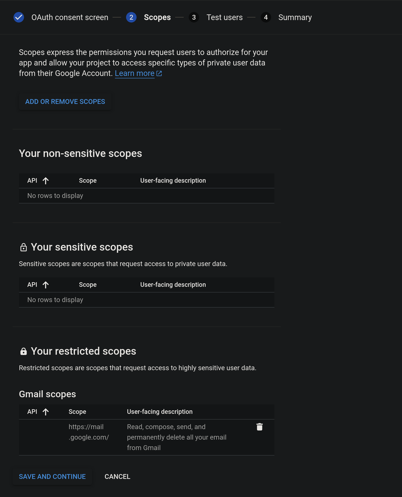

# Register a new app with Google

## Create a new project

Go to [Google cloud console](https://console.cloud.google.com/projectcreate) and
create a new project.

## Configure the [Oauth consent screen](https://console.cloud.google.com/apis/credentials/consent).

- Choose "External" User Type.

    

- Fill "App name", and set "User support email" and "Developer contact information" to your Gmail account.

    

- Manually add the `https://mail.google.com` scope.

    

    

- Add the accounts you want to remotely filter to test users.

    

- Summary

    

## Get client credentials

- Go to [Credentials](https://console.cloud.google.com/apis/credentials) and
    click on "Create Credentials". Choose "OAuth client ID".

    

- Choose "Desktop app" and name it. (You can experiment with TVs and Limited
    Input devices for device code flow on headless servers.)

- Download the json file and keep it safe.

    

    
