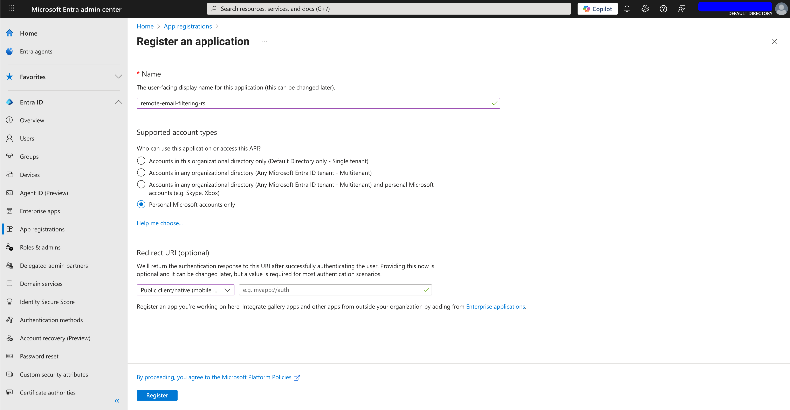
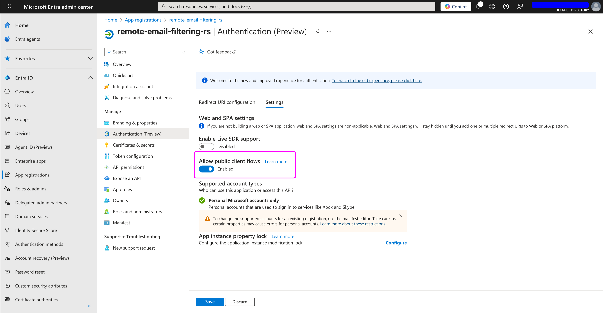
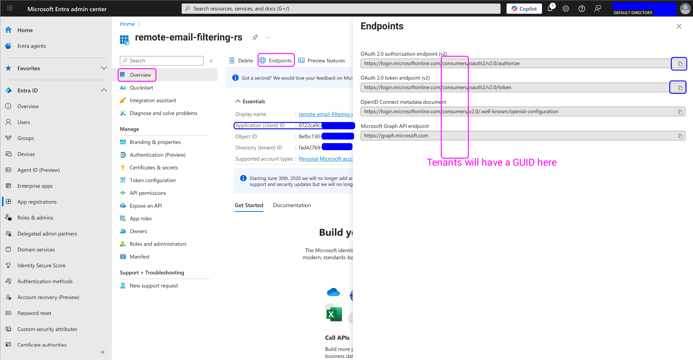

# Register a new app with Microsoft

## Create a new project

Go to [Microsoft Entra](https://entra.microsoft.com) (or whatever they decided
to rename it to by the time you read this), go to App registrations and
create a app in your tenant.

## Configure the application

- Disable "Enable live SDK support".
- Enable "Allow public client flows".

    

## Get client credentials

- Go to "Overview" and click on "Endpoints".
- Save the "OAuth2.0 authorization endpoint", "OAuth2.0 token endpoint" and the
    "Application (client) id" from the previous screen.

    
